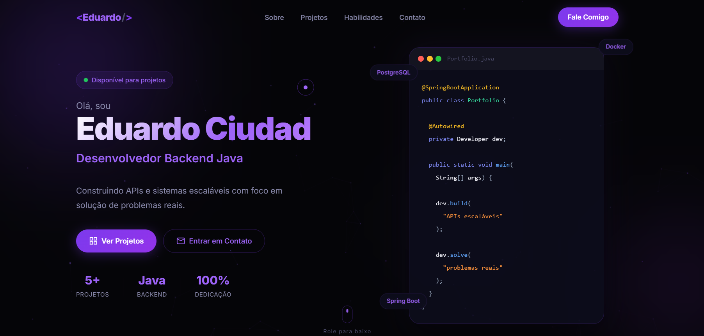

# 💻 Portfólio - Eduardo Ciudad



Portfólio profissional desenvolvido para apresentar meus projetos, habilidades e experiências como desenvolvedor backend.

👉 Acesse o site:
https://eduardo-ciudad.github.io/portifolio-eduardo-ciudad/

---

## 🚀 Sobre o projeto

Este portfólio foi desenvolvido com foco em:

* Apresentação profissional para recrutadores e clientes
* Experiência moderna e interativa
* Destaque de projetos reais com deploy
* Interface responsiva e performática

O design segue uma identidade visual **dark mode com tons roxos**, trazendo uma estética moderna e tecnológica.

---

## 🧠 Tecnologias utilizadas

### Frontend

* HTML5
* CSS3
* JavaScript (Vanilla)

### Backend (experiência apresentada nos projetos)

* Java
* Spring Boot
* Spring Security

### Testes

* JUnit
* Mockito

### Banco de dados

* PostgreSQL
* MySQL

### Ferramentas

* Docker
* Flyway
* Nginx
* Git & GitHub
* GitHub Actions
* Cloudflare R2
* Mercado Pago

---

## ✨ Funcionalidades

* 🎯 Navegação suave entre seções
* 🎨 Animações modernas ao scroll
* 📱 Layout totalmente responsivo
* 💼 Seção de projetos com links reais
* 📞 Área de contato com CTA direto
* ⚡ Interface otimizada para performance

---

## 📂 Estrutura do projeto

```id="p0q1az"
📁 portfolio
 ├── index.html
 ├── style.css
 ├── script.js
 └── assets/
     └── img/
```

---

## 💼 Projetos em destaque

### 💰 Controle Financeiro

Sistema multi-tenant de controle financeiro com JWT, rate limiting, verificação de email, LGPD compliance e deploy em VPS própria com Docker, Nginx e SSL.

🔗 https://controle-financeiro-lab-frontend.vercel.app/

---

### 🧠 StudyMind

Plataforma de estudos com IA integrada (Anthropic API) — onboarding conversacional gera plano de estudos personalizado, dashboard de desempenho e recomendações automáticas.

🔗 https://eduardo-ciudad.github.io/frontend-study-mind/

---

### 🛍️ GabiKids — E-commerce Completo

E-commerce fullstack de moda infantil com pagamento via Mercado Pago (cartão e Pix), imagens no Cloudflare R2 e deploy em VPS própria com Docker, Nginx e SSL.

🔗 https://gabikids.duckdns.org:8081

---

### 📚 Sistema de Biblioteca

Sistema fullstack com CRUD completo e controle de empréstimos.

🔗 https://eduardo-ciudad.github.io/frontend-biblioteca-api/login.html

---

Outros projetos em desenvolvimento incluem **TrilhaX** e **ATSReady**, além de landing pages freelance para clientes reais.

---

## 📈 Objetivo

Atualmente busco:

* 💼 Oportunidades como desenvolvedor backend junior
* 🚀 Projetos freelance (sites e sistemas)

---

## 📞 Contato

* 📱 WhatsApp: (17) 99706-1100
* 📧 Email: [eduardociudadfigueredo@gmail.com](mailto:eduardociudadfigueredo@gmail.com)
* 💻 GitHub: https://github.com/eduardo-Ciudad
* 🔗 LinkedIn: https://www.linkedin.com/in/eduardociudadf/

---

## ⚡ Diferenciais

* Projetos com deploy real
* Experiência com APIs REST e arquitetura backend
* Testes automatizados
* Consistência em estudos e desenvolvimento

---

## 📌 Observação

Este projeto está em constante evolução conforme avanço nos estudos e novos projetos são desenvolvidos.

---

# 🔥 Eduardo Ciudad

Desenvolvedor Backend Java
